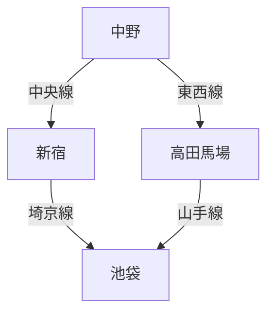
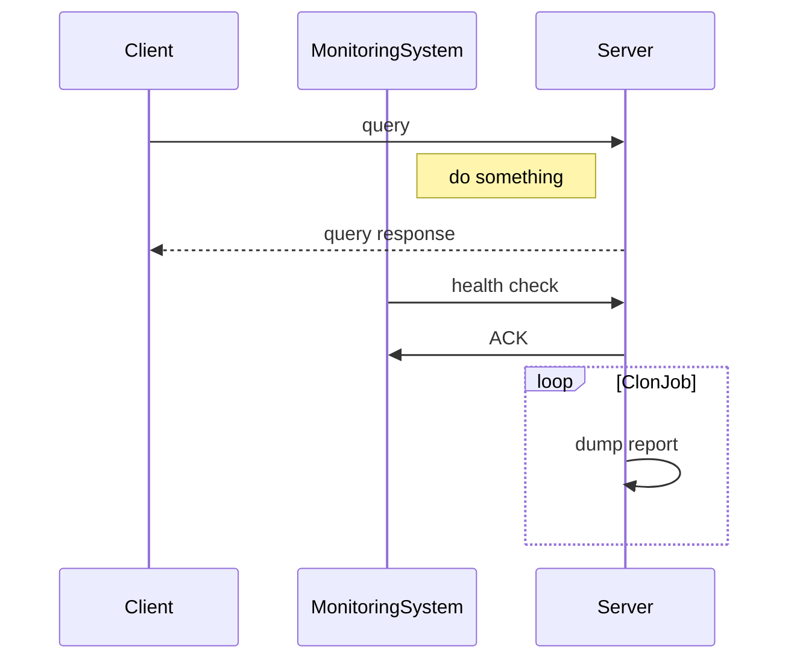
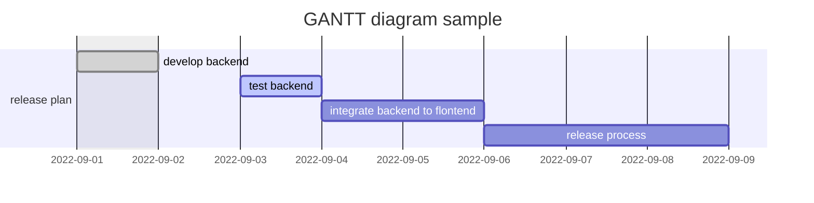

# Mermaid記法メモ
## Mermaidとは
Markdownにインスパイアされて生まれたツールで、テキストで定義した要素をレンダリングして様々なダイアグラムや図を可視化することができる。

ざっくりと以下のような図を表現することができる。

### Flowchart （フローチャート図)
```javascript
graph TD;
    中野-->|中央線|新宿;
    中野-->|東西線|高田馬場;
    新宿-->|埼京線|池袋;
    高田馬場-->|山手線|池袋;
```


### Sequence diagram (状態遷移図)
```javascript
sequenceDiagram
    participant Client
    participant MonitoringSystem
    Client->>Server: query
    Note right of MonitoringSystem: do something
    Server-->>Client: query response
    MonitoringSystem->>Server: health check
    Server->>MonitoringSystem: ACK
    loop ClonJob
        Server->>Server: dump report
    end
```


### Gantt diagram (ガントチャート)
```javascript
gantt
dateFormat  YYYY-MM-DD
title GANTT diagram sample
excludes weekdays 2022-09-01

section release plan
develop backend: done, des1, 2022-09-01,2022-09-02
test backend: active, des2, 2022-09-03, 1d
integrate backend to flontend: des3, after des2, 2d
release process: des4, after des3, 3d
```


### Class diagram (クラス図)

### Git graph (Gitグラフ)

### Entity Relationship Diagram \*experimental (ER図/実体関連図)

### User Journey Diagram

続きは後で。
